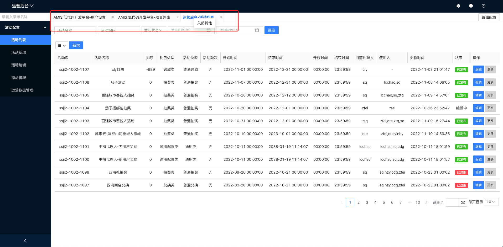
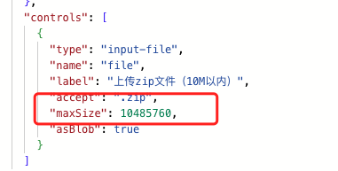
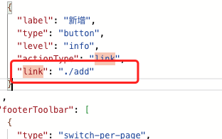

# 1.概述

## 1.1 需求背景与价值

-   由于老低代码平台工程代码使用原生，jq 开发，后期需求迭代和代码维护都比较困难。
-   老平台是基于百度的 amis 低代码框架开发，但是版本过低，稳定性不足，无法使用新功能。

## 1.2 接口文档

[YAPI 接口文档](http://192.168.0.74:3000/project/398/interface/api)

# 2. 相关文档

## 2.1 文档

[老低代码平台相关](http://confluence.wd.com/pages/viewpage.action?pageId=40505109)

[amis 低代码框架文档](https://aisuda.bce.baidu.com/amis/zh-CN/docs/index)

# 3.项目排期

## 3.1 需求时间线

| 事项         | 日期    |
| ------------ | ------- |
| 需求评审     | 2022.9  |
| 技术评审     | 2022.9  |
| 开发以及联调 | 2022.9  |
| 测试         | 2022.10 |
| 上线         | 2022.10 |

## 3.2 排期拆分

|              | 排期（人/天） | 模块 owner |
| ------------ | ------------- | ---------- |
| 项目搭建     | 2             | 尹彬宇     |
| 页面框架搭建 | 2             | 尹彬宇     |
| 功能开发     | 2             | 尹彬宇     |
| 自测         | 1             | 尹彬宇     |

# 4. 设计方案

## 4.1 整体方案

### 技术选型

使用最新的 vue3+vite+ts 框架搭建项目，使用 amis2.3 版本的低代码框架

### 部署方案

gitlab-ci

## 4.2 页面设计

### **页面描述**

采用典型的头，左侧菜单，右侧页面展示的布局。

### **新功能**

-   新增 tabs 栏功能，支持多个页面同时打开，切换，中间关闭标签，右键下拉菜单可关闭其他。tabs 标签栏已做浏览器缓存，关闭浏览器后下次打开可展示上次的 tabs 标签。
    
-   新增项目分类和菜单搜索功能。

# 5. 注意事项以及迁移

## 5.1 低代码配置问题

-   上传组件中 maxSize 新版本已改为数字类型，需要将原来的 string 改为 number
    

-   页面跳转在下图中 link 字段中应改为相对路径写法
    
