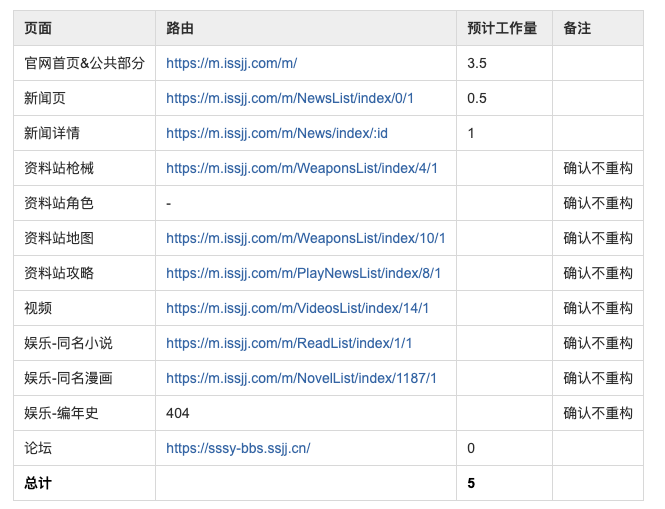

# 1.概述

## 1.1 需求背景与价值

-   由于服务端代码出现漏洞，趁服务端重构，前端一起重构。
-   老官网前后端不分离，前端使用 php 混合写法，后期难以迭代和维护，故重构。

## 1.2 接口文档

[YAPI 接口文档](http://192.168.0.74:3000/project/413/interface/api)

# 2. 相关文档

## 2.1 文档

[Nuxt3 官网](https://nuxt.com/)

# 3.项目排期

## 3.1 需求时间线

| 事项         | 日期    |
| ------------ | ------- |
| 需求评审     | 2022.10 |
| 技术评审     | 2022.10 |
| 开发以及联调 | 2022.10 |
| 测试         | 2022.10 |
| 上线         | 2022.10 |

## 3.2 排期拆分

### **pc官网**

| 页面                                  | 地址                                   | 预计工作量 | 备注       |
| ------------------------------------- | -------------------------------------- | ---------- | ---------- |
| 官网首页                              | http://www.issjj.com/                  | 2          |
| 公共部分（头部，尾部等）              |                                        | 1.5        |
| 新闻页                                | https://www.issjj.com/news             | 0.5        |
| 新闻详情                              | https://www.issjj.com/news/allinfo/:id | 0.5        |
| 资料站枪械                            | https://www.issjj.com/data/armoury/    |            | 确认不重构 |
| 资料站角色                            | https://www.issjj.com/data/role_int    |            | 确认不重构 |
| 资料站地图                            | https://www.issjj.com/data/map         |            | 确认不重构 |
| 资料站攻略                            | https://www.issjj.com/data/walkthrough |            | 确认不重构 |
| 视频（详情）                          | https://www.issjj.com/video/video      |            | 确认不重构 |
| 娱乐-同名小说                         | https://www.issjj.com/amuse/novel      |            | 确认不重构 |
| 娱乐-同名漫画                         | https://www.issjj.com/amuse/cartoon    |            | 确认不重构 |
| 娱乐-编年史                           | https://www.issjj.com/amuse/annal      |            | 确认不重构 |
| 客服                                  | https://www.issjj.com/kf               | 0.5        |
| 注册                                  | http://reg.issjj.com/newReg            | 1.5        |
| 登录                                  | http://reg.issjj.com/newLogin          | 1.5        |
| 赛事                                  | http://spl.issjj.com/                  |            | 确认不重构 |
| 充值                                  | https://m.issjj.com/front.html         | 复用老的   |
| 活动                                  | http://m.issjj.com/5years/             |            | 确认不重构 |
| 监护                                  | https://m.issjj.com/jianhu/index.html  | 复用老的   |
| https://m.issjj.com/jianhu/guide.html | 复用老的                               |
| https://m.issjj.com/jianhu/flow.html  | 复用老的                               |
| https://m.issjj.com/jianhu/flow.html  | 复用老的                               |
| 协议                                  | http://www.wan5d.com/xieyi.html        | 复用老的   |
| https://m.issjj.com/etxy.html         | 复用老的                               |
| 广告                                  | http://m.issjj.com/ad/                 |
| 个人中心                              | http://m.issjj.com/m/Management/main   | 4.5        |
| 总计                                  |                                        | 12.5       |

### **h5官网**

总计17.5天

# 4. 设计方案

## 4.1 整体方案

### 技术选型

使用最新的 Nuxt3 + vue + ts + windicss服务端渲染方案。

### 部署方案

gitlab-ci

## 4.2 页面设计

### **页面描述**

按照老官网还原页面样式。