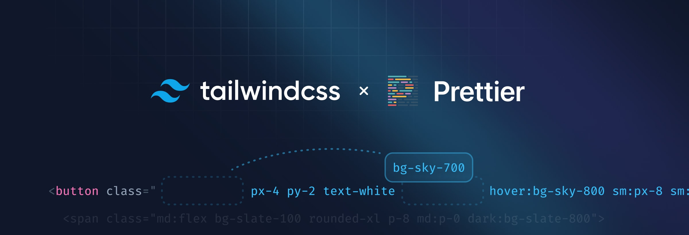

# 入门

Tailwind CSS 的工作原理是扫描您的所有 HTML 文件、JavaScript 组件和任何其他模板以查找类名，生成相应的样式，然后将它们写入静态 CSS 文件。

## 步骤. 1: 创建一个新项目

这里我们以vite项目为例。

```sh
$ pnpm create vite@latest my-project -- --template vue
```

切换到新建的项目。

```sh
$ cd my-project
```

## 步骤. 2: 安装 Tailwind CSS

通过 npm 安装 tailwindcss 及其对等依赖项。

```sh
$ pnpm add -D tailwindcss postcss autoprefixer
```

然后运行 ​​init 命令生成 tailwind.config.cjs 和 postcss.config.cjs。

```sh
$ npx tailwindcss init -p
```

## 步骤. 3: 配置模板路径

在 tailwind.config.cjs 文件中添加所有模板文件的路径

```js
/** @type {import('tailwindcss').Config} */
module.exports = {
  content: [
    "./index.html",
    "./src/**/*.{vue,js,ts,jsx,tsx}",
  ],
  theme: {
    extend: {},
  },
  plugins: [],
}
```

## 步骤. 4: 将 Tailwind 指令添加到您的 CSS

将 Tailwind 的每个层的 @tailwind 指令添加到您的 ./src/style.css 文件中。

```css
@tailwind base;
@tailwind components;
@tailwind utilities;
```


## 步骤. 5: 使用 pnpm run dev 运行构建过程。

```sh
pnpm run dev
```

## 步骤. 6: 开始在您的项目中使用 Tailwind

开始使用 Tailwind 的实用程序类来设置你的内容样式。

```vue
<template>
  <h1 class="text-3xl font-bold underline">
    Hello world!
  </h1>
</template>
```

## 步骤. 7: 用于 VS Code的智能感知

用于 Visual Studio Code 的官方 [Tailwind CSS IntelliSense](https://marketplace.visualstudio.com/items?itemName=bradlc.vscode-tailwindcss)扩展通过为用户提供自动完成、语法突出显示和 linting 等高级功能来增强 Tailwind 开发体验。


- 自动完成。对类名以及CSS 函数和指令的智能建议。
- 棉绒。突出显示 CSS 和标记中的错误和潜在错误。
- 悬停预览。将鼠标悬停在 Tailwind 类名称上，查看完整的 CSS。
- 语法高亮。提供语法定义，以便正确突出显示 Tailwind 功能。

### Prettier 自动分类排序

Tailwind CSS 维护了一个官方 [Prettier 插件](https://github.com/tailwindlabs/prettier-plugin-tailwindcss)，该插件会按照我们[推荐的类顺序](https://tailwindcss.com/blog/automatic-class-sorting-with-prettier#how-classes-are-sorted)自动对您的类进行排序。



它可以与自定义 Tailwind 配置无缝协作，并且因为它只是一个 Prettier 插件，所以它可以在任何 Prettier 工作的地方工作——包括每个流行的编辑器和 IDE，当然还有命令行。

```html
<!-- Before -->
<button class="text-white px-4 sm:px-8 py-2 sm:py-3 bg-sky-700 hover:bg-sky-800">...</button>

<!-- After -->
<button class="bg-sky-700 px-4 py-2 text-white hover:bg-sky-800 sm:px-8 sm:py-3">...</button>
```

## 总结

还有更多的使用教程可以去[tailwindcss官网](https://windicss.org/)查看。